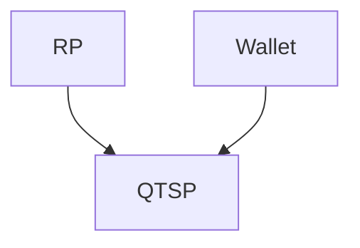

- hat was mit [[eID]] zu tun

### Rollen
1. Wallet
2. [[QTSP]]
3. [[Relying Party]] (derjenige, der dem [[QTSP]] vertraut)

![[Pasted image 20251006144244.png]]
## Wallet-centric model
- **Wallet**: Zentraler Punkt für Nutzer, Transaktionen zu managen/durchzuführen (z.B. online-banking aber broader)
- [[QTSP]] kann vom User ausgewählt wreden
- SIC/SCA ist integriert im Wallet

## QTSP-cntric
- Wallet [[Authentication|authenticates]] und [[Authorization|authorizes]] [[Electronic Signature]]s
- Relying Party wählt [[QTSP]] aus
- SIC/SCA integriert in RP oder QTSP

