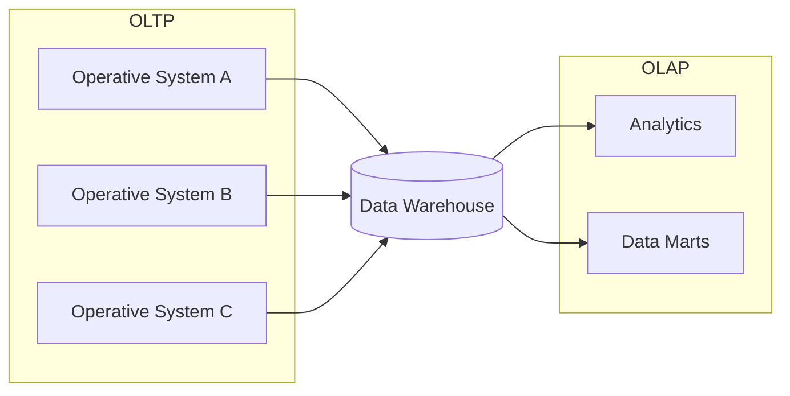
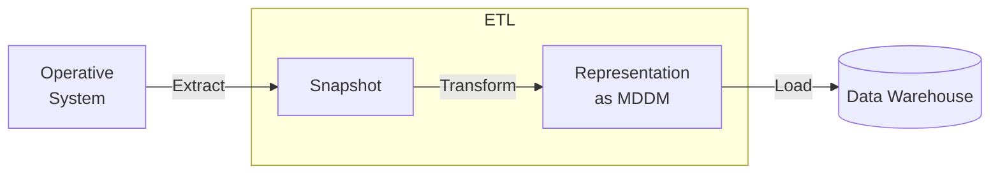

> A stupid write-up on data warehousing which I have absolutely zero motivation of doing fuck yoiu
> okay fuck the write-up i think I understand it well enough not to completely blow the Klausur fuck passing this on to anybody who would want to read this rambling anyway

# 0. Introduction
In the modern internet, data is everything. It is practically a must for any business operating online to collect data and analytics in order to stay competitive. Simply collecting data is not enough, however. In order to provide value on a business level, data needs to be constantly analyzed and evaluated so that services can be continuously improved. Additionally, a lot of data is only useful over long periods of time, where only then trends start to show and correlations become apparent. For this reason, these massive volumes of data need to not only be continuously mined and analyzed, but only stored.

Attempting to adhere to these requirements strictly within the existing applications does not only break principles of dedication, but is practically infeasible due to the scale. It is thus, that a dedicated system needs to be introduced to perform these tasks: The **[[Data Warehouse]]**.

The data warehouse serves as a single point of truth for all enterprise analytics. It is built specifically with the goal of providing easy, ad-hoc and fast querying and analysis of data. As such, it is the key component in modern Business Intelligence (BI) systems. This write-up shall serve as a simple introduction to the basic principles, archtectures and techniques underlying Data Warehousing.

# 1. Architecture
Traditionally, the application landscape of IT consists of only a few customer-facing applications. Each application solves a concrete problem and provides value to a customer, and revenue to the provider. These applicatoins are generally called **[[Operative System|Operative Systems]]**, for they are responsible for operations. The data warehouse exists on the back-end of these applications, as can be seen in the following diagram:


Note how in this simple view, the data flows in only one direction - from operative systems into the data warehouse, and from the data warehouse into analytics and data marts. (Note also that this representation is sub-optimal, as once the data is stored in the warehouse it does not move out, instead only is queried by the analytics applications). 
## 1.1 Operative Systems
As previously established, Operative systems are generally customer-facing applications. An operative system is itself a contained entity, and thus has its own storage. These applications are generally categorized by high rates of write operations, as state is created, updated or deleted. This sort of transactional usage is generally called "**OnLine Transactional Processing** ([[OLTP]])Data models of operative systems are designed to serve in the most performant way possible; For example, by using a lot of different relations. While this makes reads slow throuth the necessity of **joins** over multiple tables, however write operations are fast. Similarly, the structures are generally **normalized** to 3NF or beyond to ensure consistency. Due to the performance requirements of operative systems, the size of their databases is also limited - resulting in measures to periodically clear unused data.
## 1.2 Analytics
While the goal of Operative Systems is to ensure operations, the goal of analytics is to provide business intelligence and inform executive decisions. The resulting requirements to the data model of a data warehouse optimized for analytics are vastly different to those of operative systems.. Analytical tasks require to sieve through large amounts of data quickly; Write operations are rare, and the read operations involve large amounts of data. This sort of workload is called "**OnLine Analytical Processing**" ([[OLAP]]). The data model inside a data warehouse should enable such operations as performant as possible. This rules out a traditionally normalized RDB, and requires different ways to look at data. Additionally, Data once stored in a data warehouse is  generally immutable - making the performance of write operations a lesser concern.

# 2. Multidimensional Data Storage
As previously established, analytical operations have specific requirements to the data mode. In order to develop a concept of how these requirements can be met, it is worth to examine the nature of a data query. Such a query can be thought of as a series of filters: 

> Within the gigantic cloud of data, filter out all $X$ that adhere to a series of conditions $c_{1..i}$.

Each condition can be seen as an expression of the sentence "... where Attribute $A$ is an element of a restrictive set $S$". Given this structure, it becomes apparent that data needs to be seen as a grouping of attributes, rather than a grouping of relations. (??????? ich weiß was ich ausdrücken will aber nicht wie)
## 2.1 Data Cubes
A way to visualize a structure adhering to this sort of query is with an n-dimensional [[MDDM Cube|Cube]][^1]. Each dimension of the cube represents an attribute - for example a timestamp, or a categorization. Each cell in the cube represents exactly one data point. The following picture is an example of such a data cube, that will be used throughout this section to demonstrate Operations. It consists of three dimensions: A City, a Timestamp, and a Product Type. A datapoint represents revenue.

![[Pasted image 20251021100227.png]]

We can define operations on such a data cube, that can be used to obtain analytical Information. In this section, I will introduce the simple operations that can be performed on a cube: selection, slice and dice. The more advanced operations of drill-down and roll-up require additional information and will be introduced in a later section.

[^1]: technically, it's a cuboid since not all edges necessarily have the same length

### 2.1.1 Selection/Filter
A selection does exactly what its name suggests: It celects a singular cell. This happens by specifying an exact value to match for each dimension. For example, using pseudo code:

```js
cube.filter(city == 'berlin') // note the attribute == value specification
	.filter(year == "January 2006")
	.filter(product == "TP T60")
```

This specific query would yield a revenue of `87.000`€ in the above example.

### 2.1.2 Slice
A slice reduces a an $n$-dimensional cube to an $n-1$-dimensional cube.
In other words, a slice fixes one dimension:

```js
cube.filter(city == "Stuttgart")
```

### 2.1.3 Dice
A dice keeps the dimension of the cube, but reduces the amount of data points contained in it.
In other words, it imposes a limit on one or more dimensions which, in each dimension, filters out at least one possible value.

```js
cube.filter(city != "Stuttgart)
	.filter(month > January)
```

### 2.1.4 Pivot/Rotate
This operation once again is self-describing: it rotates the view of the cube. In practice, this conforms to swapping two dimensions (e.g. placing `city` on the $x_{3}$ axis, and `date` on the $x_{1}$ axis in the above example).

### 2.1.5 Drill Down and Roll Up
> [!hint] Note: These two operations technically require the introduction of [[#2.2 Hierarchical Structure]], but that just makes grouping more difficult so I'll throw them into here

Drill Down and Roll Up change the detail of a dimension. For example, in the example above, one could increase the level of detail by looking not only at the combination of year/month, but including the individual date. This increase of detail is called [[Drill Down]].

Conversely, the level of detail can be reduced, by taking information away. An example of this could be to replace the `City` dimension with the less fine-grained view based on countries. This decrease of detail is called [[Roll Up]].
## 2.2 Hierarchical Structure
Data typically exists not as a flat aggregation of dimensions, but rather as a hierarchy of them, where each layer is more detailed than the one above. A good example for this is location data, wich forms a tree starting from continent at the top, and theoretically going all the way down to a specific address. For simplicity's sake, I truncated this to only three levels:

![[Pasted image 20251212193856.png]]

Ideally, all levels of the tree are always filled. However, since information is presented differently in different operative systems, there are two core deformations that can exist in a hierarchy like this: **Imbalance** and **Raggedness**.

### 2.2.1 Imbalance
An Imbalance exists when two leaves of the hierarchy are at different path lengths from the root. In the example of cities above, the state of `Bayern` could have no cities attached to it, causing inconsistent depth of the tree.

### 2.2.2 Raggedness
A hierarchy is ragged, if a level is skipped. For example, in the above tree of cities, `Frankfurt` could be a direct child of `Germany`, leaving out the intermediate level of the state.


### 2.2.3 Hierarchical Drift
#todo

## 2.3 Realization in Relational Databases
Since Relational Databases have been the standard for storing structured data, there exists a mature pool of products, and a large talent pool. This naturally makes relational databases a desirable choice for storage within a data warehouse.

However, realizing a dimension-driven data model as described in [[#2.1 Data Cubes]] requires a design different from the traditional entity-oriented approach.

### 2.3.1 The Star Schema
In the star schema, relations are categorized into **dimension** and **fact tables**. Dimension tables hold values for each dimension, along with descriptive metadata about their dimension. Fact tables hold the data contained in a singular cell of the cube. In order to allow quick querying, the fact table holds foreign keys to every associated dimension, pointing to the tuple representing the value associated to the fact entry.
When drawn in an ERM, the origins of the schema's name become apparent:

![[Pasted image 20251212202508.png]]

### 2.3.2 The Snowflake Schema
The Snowflake Schema is an extension of the Star Schema, which can model dimensional hierachies as described in [[#2.2 Hierarchical Structure]]. By introducing foreign from dimension tables to dimension tables, such a hierarchy can be encoded in a star schema. The resulting ERM will continuously branch out, thus resembling a snowflake. It is important to note here that the **most detailled** level of the hierarchy must be referenced by the fact table in order to ensure full retainage of information. 

![[Pasted image 20251212203935.png]]

## 2.3 OLAP
[[OLAP]] essentially only refers to the processing related to querying and evaluating the data stored within a multi-dimensional model.


- ja das ding mit dem Redis-like cache halt
- und die anforderungen oder so
- Metadata?

### 2.3.? Arten
OLAP can be categorized into 4 distinct types:

|           | Full name         | Description                                      | Notes                    |
| --------- | ----------------- | ------------------------------------------------ | ------------------------ |
| **MOLAP** | Multi-dimensional | OLAP working directly on a MDDM model            |                          |
| **ROLAP** | Relational        | OLAP working on a Relational MDDM implementation |                          |
| **HOLAP** | Hybrid            | Combination of MOLAP and ROLAP                   |                          |
| **DOLAP** | Desktop           | Based on desktop applications                    | (practically deprecated) |
# 3. ETL Pipeline
With the OLAP Data Models established, the last remaining aspect in the Data Warehouse architecture is the question: How does data get from the operative systems into the data warehouse? This is a non-trivial task due to the fundamental difference in how data must be stored to meet the system's respective requirements. Difficulty is increased further by the sheer scale of data that must be handled by this process.

In its core, this process is handled by a so-called [[Extract - Transform - Load|ETL Pipeline]], standing for **E**xtract, **T**ransform, and **L**oad.




## 3.1 Extract
In the extraction stage of the ETL pipeline, the operative systems need to be monitored and data scraped.

### 3.1.1 Monitoring
There are multiple techniques to monitoring operative systems. The simplest one is a simple polling strategy, where the monitoring system continuously polls operative systems for new data at fixed time intervals. Alternative approaches include:

- **Hook-Based**: operative System exposes Hooks (?)
- **Event-Based**: Operative System notifies DWH of changes through e.g. a message queue
- **RDBMS-based** (because everything can be done in Postgres)
	- **changelog** tables: Seperate tables where the DB writes in
	- **protocol-based**: Fetch the information from transaction logs

ja keine Ahnung digga wieso hab ich eigentlich gesagt ich mach ds Fließtext FUCKING SHIT

### 3.1.2 Extraction
There are multiple ways to determine when to extract data from an operative system:
- **Periodically** through Polling: Data is extracted at set time intervals
- **Event** or **Request**-based: Defining a set of rules of when Data should be extracted
	- for example: A new product is added, some critical row is updated
- **Instantly**: Every write to an operative system's database is instantly sent through the ETL pipeline

The last of these approaches, instantly replicating upon any change, gives rise to a new subcategory of data warehouses: The real-time data warehouses.

## 3.1 Transform
In the transformation stage of the ETL pipeline, data needs to be consolidated and translated into the data warehouse's model. The key challenge here is to consolidate different representations.
#todo

##  3.3 Load
Once data is properly transformed, loading it into the data warehouse is a rather trivial, yet time-consuming task. Latter mainly arises due to the potential volumes of data, in combination with the aforementioned focus of the data model lying more on efficient reads and disregarding efficiency of writes.
Due to the high performacne costs, it may be a worthy consideration to take the data warehouse offline during the load; this makes analytical querying impossible for this timeframe, but may speed along the loading of data. This is especially a good option if large bulk loads are loaded, instead of a continuous stream of smaller data batches.

# (4. Projektmanagement)