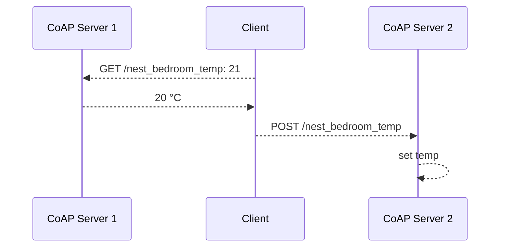

---
aliases:
  - CoAP
---
> [[Layer 7|Application Layer]] Protocol
> Request/Response oriented

> [!hint] Builds on top of [[UDP]]

- speziell ausgelegt für constrainte Knoten (i.e. low-power [[IoT]] stuff)
- stark angelehnt an [[HTTP]]

