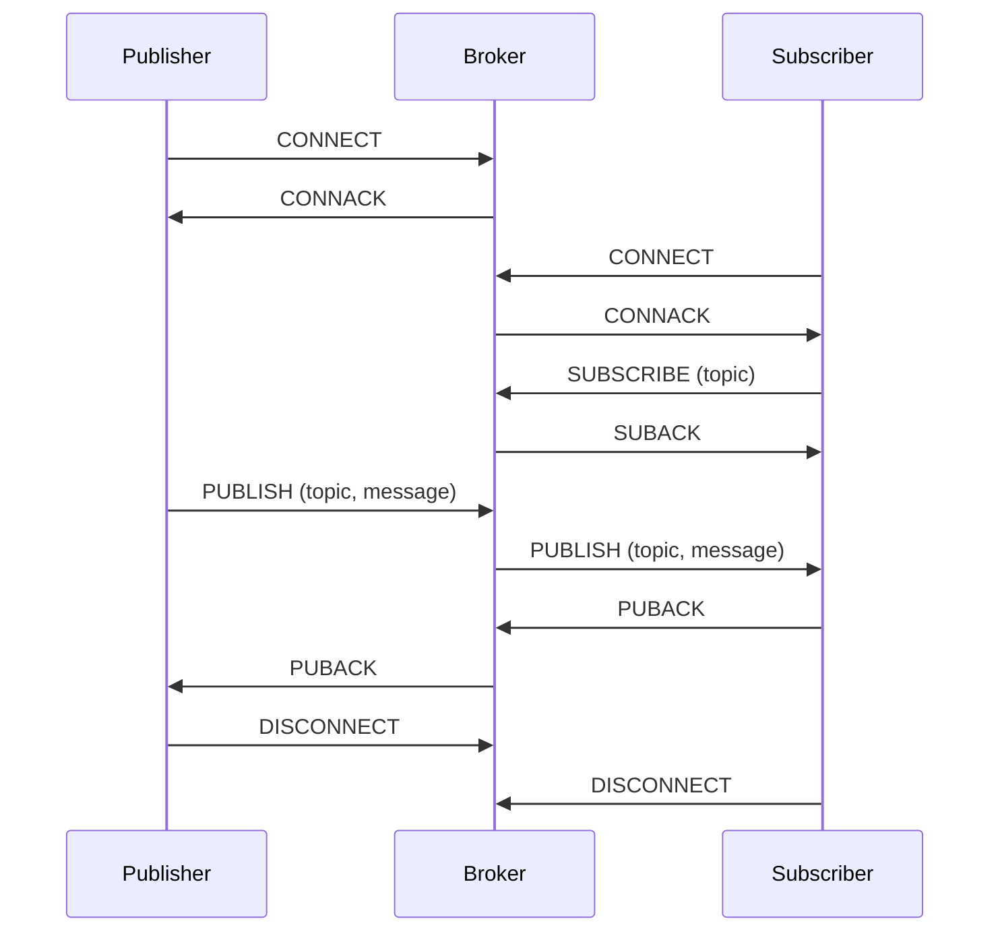

> [[Message Queue|Message Queuing]] Telemetry Transport

[[Rust MQTT Broker]]

- [[Layer 7]] protocol on top of [[TCP]]
- kann extended werden mit [[TLS]]

## Roles
> [!hint] Bildet ein [[Client Server Architecture|Client-Server Modell]], mit dem Broker being the server.
- [[Message Broker]]
- [[Client]]: Jedes Gerät, was sich beim [[Message Broker]] registriert

## Ablauf
- publisher/subscriver architecture -> [[Event-driven Architecture]]
- [[ACK]]

