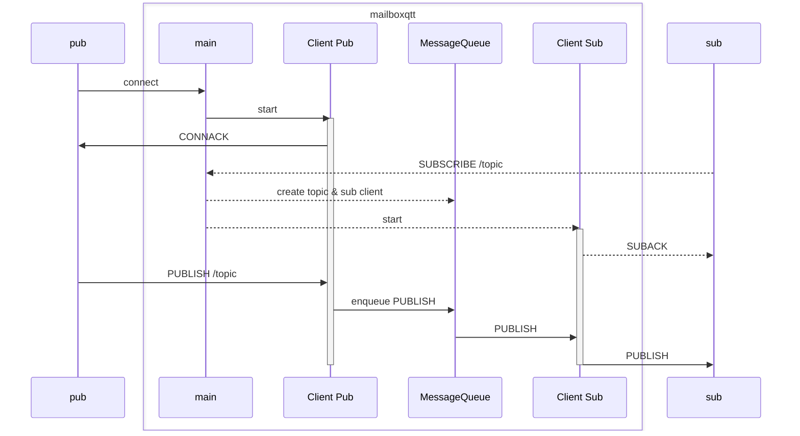
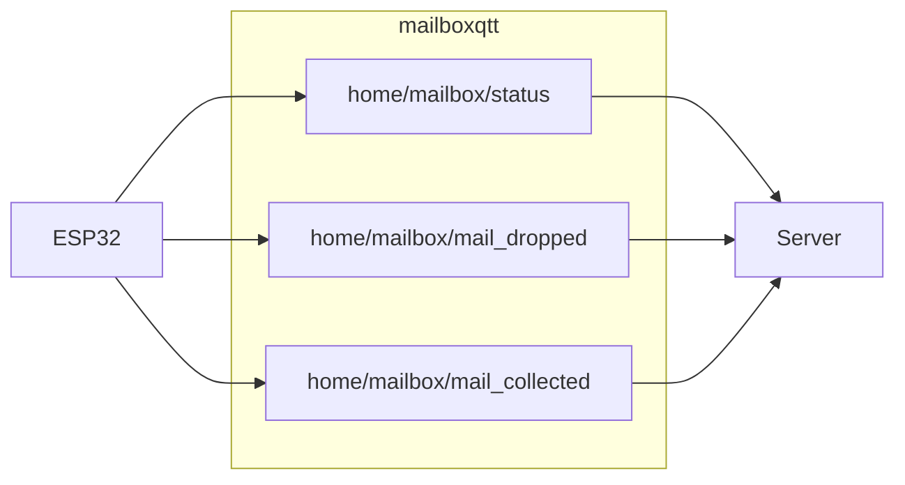
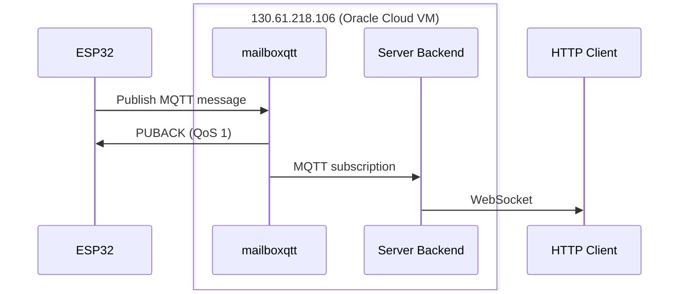

[[MQTT]]

```mermaid
sequenceDiagram
participant pub

box mailboxqtt
participant main
participant Client Pub
participant MessageQueue
participant Client Sub
end

participant sub

pub ->> main: connect
main ->> Client Pub: start
activate Client Pub
Client Pub ->> pub: CONNACK

sub -->> main: SUBSCRIBE /topic
main -->> MessageQueue: create topic & sub client
main -->> Client Sub: start
activate Client Sub
Client Sub -->> sub: SUBACK


pub ->> Client Pub: PUBLISH /topic
Client Pub ->> MessageQueue: enqueue PUBLISH
MessageQueue ->> Client Sub: PUBLISH
Client Sub ->> sub: PUBLISH


deactivate Client Pub
deactivate Client Sub

```

## Im gesamten Brief-Stuff

```mermaid
flowchart LR
ESP32 --> A
ESP32 --> B
ESP32 --> C

subgraph mailboxqtt
	direction TB
	A["home/mailbox/status"]
	B["home/mailbox/mail_dropped"]
	C["home/mailbox/mail_collected"]
end
A --> Server
B --> Server
C --> Server
```

```mermaid
sequenceDiagram
    participant ESP32
    box 130.61.218.106 (Oracle Cloud VM)
	    participant mailboxqtt
	    participant Server Backend
    end
    participant HTTP Client
    
    ESP32->>mailboxqtt: Publish MQTT message
    mailboxqtt->>ESP32: PUBACK (QoS 1)
    mailboxqtt->>Server Backend: MQTT subscription
    Server Backend->>HTTP Client: WebSocket
```

