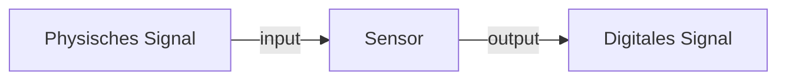

[[D-Technik 1.2 Transistoren.pdf]]

## Dumme Defintion
Ein [[Sensor]] kann definiert werden als eine [[Funktion]]
$$f: X \longrightarrow Y$$
der aus etwas in der physischen Welt $X$ Daten $Y$ macht.

![[Pasted image 20251008100034.png]]

## ramble
- kommunizieren über mehrere Pins
- in der Regel:
	- Einen High Volt
	- Einen Low Volt (i.e. Earth/0)
	- verschiedene Pins für variable Spannung (liefert die tatsächliche Information des Sensors)
