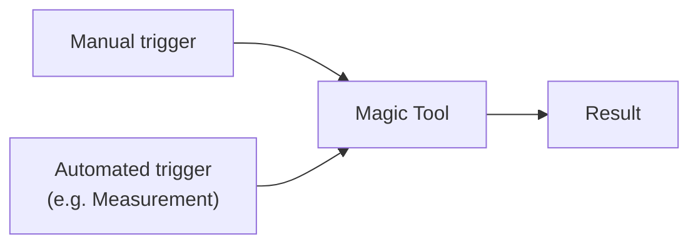

> Automisierung von Bereitstellungs- und Betriebsabläufen

- verfingerung manueller Eingriffe eines Admins
- Verkettung von Prozesschritten

### Vorteile
- Bessere [[Harmonisierung und Konsolidierung#Standardisierung|Standardisierung]]
- Höhere Flexibilität
- Kürzere Time-to-use
- 💸

### Ablauf

## Beispiel: Neuer Server
![[Pasted image 20251010103803.png]]