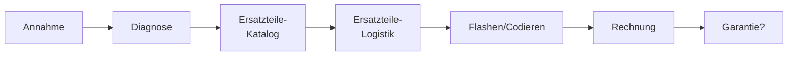

> Geschäftsprozess: Auto in Werkstatt

## Ablauf
1. Anmelden & Termin ausmachen
2. Fahrzeug hin fahren
3. Schlüssel übergeben
4. Reparaturprozess (passieren mehrere Schritte)
5. Zahlen
6. Abholen

### Intern in der Werkstatt

- ein Block: [[IT System]] ([[Anwendungs-Architektur]])
- gesamte Kette: [[Enterprise Architektur]]

#### übertragen auf infrastruktur-Komponente
1. Annahme = Applikation, lokaler PC
2. Diagnose = Diagnosegerät?
3. Katalog = Web-Server
4. Ersatztelie-Logistik = [[Main Frame]]
5. Flashen = Diagnosegerät
6. Rechnung = SAP Server
7. Garantie/Kulanz => Ausgelagert bei Kunde

> [!info] Immer eine **Applikationskomponente** (was wird gemacht), die auf verschiedenen **Infrastruktur-Komponenten** deployed sind.

> [!hint] Kombination aus einer Applicationskomponente mit korrespondierender Infrastruktur heißt "IT-System".

