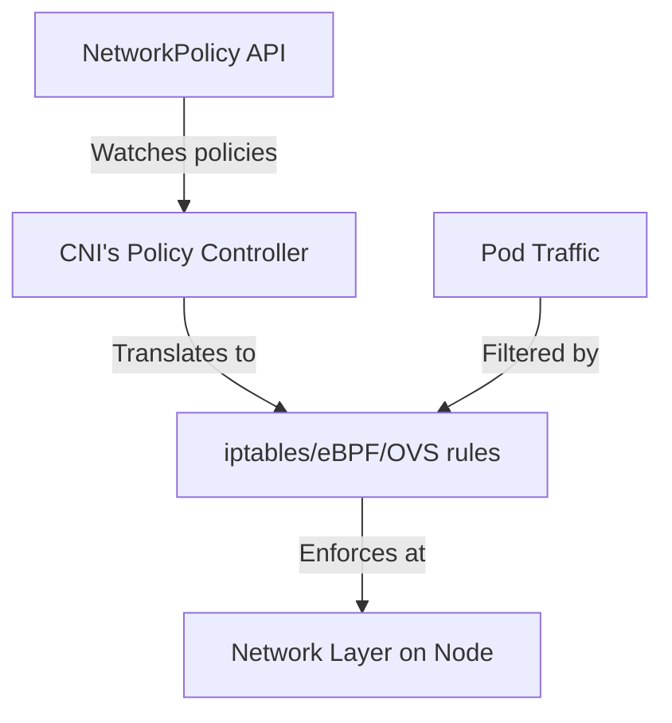

> The thing handling the internal [[Routing]] and shit

- External to kubernetes
	- was Jürgen gesagt hat: Die Anbieter sollen es selber machen

```mermaid
graph TD
    A[NetworkPolicy API] -->|Watches policies| B[CNI's Policy Controller]
    B -->|Translates to| C[iptables/eBPF/OVS rules]
    C -->|Enforces at| D[Network Layer on Node]
    E[Pod Traffic] -->|Filtered by| C
```